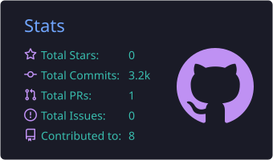
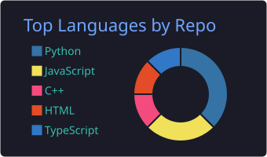
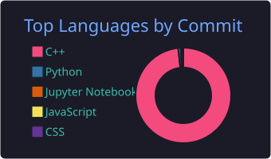

<div align="center">


### 🎓 B.Tech Computer Science @ **Delhi Technological University (DTU)** · Class of 2027

I build **AI agents, RAG systems, and real-time web apps**, from the LLM pipeline to the deployed product.

<a href="mailto:deepanshuagarwal946@gmail.com"></a>
<a href="https://www.linkedin.com/in/deepanshu-agarwal-603702274/"></a>
<a href="https://leetcode.com/u/deepanshu_agarwal946/"></a>
<a href="https://dev.to/deepanshu_agarwal_09dfdff"></a>


</div>

---

## 🧑‍💻 About me

```python
class Deepanshu:
    role       = "Full-Stack & AI Developer"
    education  = "B.Tech CSE @ Delhi Technological University (2023–2027)"
    based_in   = "Delhi, India 🇮🇳  (IST, UTC+5:30)"
    builds     = ["AI agents", "RAG chatbots", "LLM automations", "real-time web apps"]
    ai_stack   = ["LangGraph", "LangChain", "OpenAI", "Gemini", "ChromaDB", "Streamlit"]
    web_stack  = ["React", "TypeScript", "Node.js", "Express", "Socket.IO", "Tailwind"]
    status     = "✅ Available for freelance projects"
```

---

## 💼 What I can build for you

| | Service | Examples |
|:-:|---|---|
| 🤖 | **AI agents and multi-agent workflows** | Research → write → review → publish pipelines; task automation with tools and APIs |
| 📚 | **RAG chatbots over your data** | Chat with your docs, PDFs, videos, or knowledge base, with sources cited |
| ⚙️ | **LLM automation** | Content generation, summarization, data extraction, SEO, and marketing workflows |
| 🌐 | **Full-stack web apps** | React + Node.js apps, real-time collaboration, dashboards, API integrations |
| 🚀 | **Prototype → production** | Turning an AI idea or notebook into a deployed app your users can open |

---

## 🌟 Featured AI projects

<table>
<tr>
<td width="50%" valign="top">

### ⚡ [ContentForge AI](https://github.com/deepanshu946/contentforge-ai)

<a href="https://youtu.be/HGx3S3wPGvY"></a>

**A multi-agent AI content team.** One topic in, and out comes a researched, SEO-scored blog post with AI images, social posts, and a live Dev.to article.

- 11 LangGraph agents: router, research, competitor analysis, content gaps, SEO, parallel writers, auditor
- Tavily web research · Gemini image generation · LangSmith tracing

`LangGraph` `OpenAI` `Gemini` `Tavily` `Streamlit`

[🔗 **Live**](https://contentforge-ai.streamlit.app/) · [▶️ **Demo**](https://youtu.be/HGx3S3wPGvY) · [💻 **Code**](https://github.com/deepanshu946/contentforge-ai)

</td>
<td width="50%" valign="top">

### 🎥 [InsightForge AI](https://github.com/deepanshu946/InsightForge-AI)

<a href="https://youtu.be/_WRUkaEJAgk"></a>

**Chat with any video.** It transcribes YouTube or local media, then answers questions about it with cited sources and web search.

- Hybrid RAG: embeddings + BM25 → Reciprocal Rank Fusion → Cohere rerank
- GPT-4o Mini Transcribe · ChromaDB · Mistral · DuckDuckGo augmentation

`LangChain` `RAG` `ChromaDB` `OpenAI` `Streamlit`

[🔗 **Live**](https://insightforge--ai.streamlit.app/) · [▶️ **Demo**](https://youtu.be/_WRUkaEJAgk) · [💻 **Code**](https://github.com/deepanshu946/InsightForge-AI)

</td>
</tr>
</table>

## 🛠️ Full-stack and other projects

| Project | What it is | Stack | Links |
|---|---|---|---|
| 🐝 **CodeHive** | Real-time collaborative IDE: live multi-user editing, chat, shared whiteboard, AI coding help, and code execution | React · TypeScript · Express · Socket.IO · CodeMirror | [Live](https://code-hive-phi.vercel.app/) · [Code](https://github.com/deepanshu946/Code-Hive) |
| 🏥 **Rapid Admit** | Finds nearby hospitals with real-time Geoapify data, plus an AI chatbot for instant help | JavaScript · Geoapify API · AI chatbot | [Code](https://github.com/deepanshu946/Rapid-Admit) |
| 🔗 **shrnk** | URL shortener with accounts, QR codes, and click analytics (device and location charts) | React · Supabase · Tailwind · Recharts | [Live](https://shrnk-five.vercel.app) · [Code](https://github.com/deepanshu946/shrnk) |
| 🩺 **T2DM Prediction** | ML model predicting Type 2 diabetes risk from age, BMI, family history, and socio-economic factors | Python · scikit-learn | [Code](https://github.com/deepanshu946/DL_project) |

---

## 🧰 Tech stack

**Languages and web**


**AI / ML**


---

## 🏆 Achievements

- 🥇 **JEE Main All India Rank 3,248** among 1.2 million+ candidates (top 0.3% nationally)
- 🧠 **950+ LeetCode problems solved**, contest rating **1740** (top 11% globally)
- ⚔️ Global rank **1,729** in LeetCode Biweekly Contest 142

---

## 📊 Stats

<div align="center">






</div>

<div align="center">

<picture>
  <source media="(prefers-color-scheme: dark)" srcset="https://raw.githubusercontent.com/deepanshu946/deepanshu946/output/github-snake-dark.svg"/>
  
</picture>

</div>

---

<div align="center">

### 📬 Let's build something

Have an AI idea, a workflow to automate, or an app to ship? **[deepanshuagarwal946@gmail.com](mailto:deepanshuagarwal946@gmail.com)**


</div>
